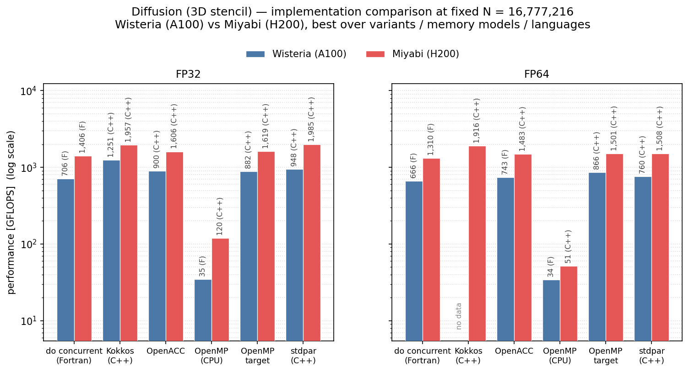
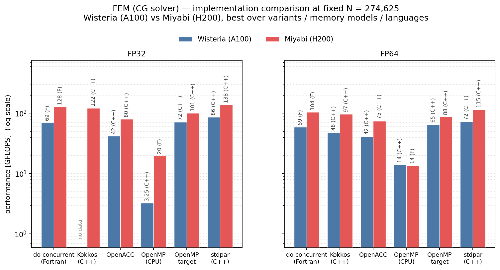
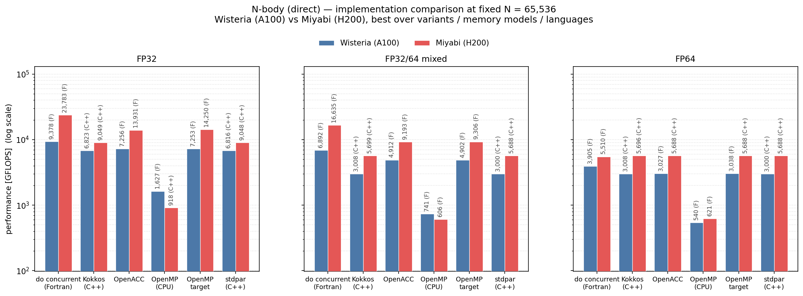

# GPU プログラミングモデル比較

本コード整備の一部は文部科学省「次世代HPC・AI開発支援拠点形成事業」の支援を受けています。

---

同じ数値計算問題を、複数の **GPU プログラミングモデル**
(OpenMP CPU / OpenMP target / OpenACC / 言語標準 stdpar・do concurrent / Kokkos) で実装し、
**書き方・性能・移植性を比較**するためのコード群です。問題の性質が異なる 3 つのアプリケーションを
収録しており、それぞれメモリ律速・不規則アクセス・演算律速という代表的な特性をカバーします。

ビルドは各アプリ diffusion/fem/nbody の `configure.py`（machine × mode × variant から CMake / Makefile とジョブスクリプトを生成）で行います。
動作検証済み環境: ローカル Linux (Ubuntu) / **Miyabi** (NVHPC, GH200, PBS Pro) / **Wisteria-A** (NVHPC, A100, PJM)。

---

## 3 つのアプリケーションと問題設定

### 1. diffusion — 3 次元拡散方程式（有限差分法）
3 次元拡散方程式 **∂f/∂t = κ ∇²f** を、空間 2 次精度の中心差分（7 点ステンシル）と
時間 1 次精度の前進 Euler 法を組み合わせた **FTCS 法 (Forward Time Centered Space)** の陽解法で解くアプリ。

### 2. fem — 3 次元有限要素法（CG ソルバ）
3 次元の熱伝導／構造解析問題を有限要素法で離散化し、**共役勾配法 (Conjugate Gradient)** で解くアプリ。

### 3. nbody — 直接法重力多体問題
直接法による重力多体計算を、時間 2 次精度の **leapfrog 法** で軌道積分するアプリ。

---

## 各アプリの詳細・使い方・性能評価

クイックスタートや使い方/ビルド手順、ディレクトリ構造はアプリごとの README 及び build-tutorial.html をご覧ください。

| アプリ | 解説 (README) | 使い方 / ビルド手順 (HTML) | 性能評価ダッシュボード (HTML) |
|---|---|---|---|
| **diffusion** | [README](diffusion/README.md) | [build-tutorial.html](https://raw.githack.com/SCD-ITC-UTokyo/gpu-apps-tutorial/main/diffusion/docs/build-tutorial.html) | [diffusion_dashboard.html](https://raw.githack.com/SCD-ITC-UTokyo/gpu-apps-tutorial/main/diffusion/summary/diffusion_dashboard.html) |
| **fem** | [README](fem/README.md) | [build-tutorial.html](https://raw.githack.com/SCD-ITC-UTokyo/gpu-apps-tutorial/main/fem/docs/build-tutorial.html) | [fem_dashboard.html](https://raw.githack.com/SCD-ITC-UTokyo/gpu-apps-tutorial/main/fem/summary/fem_dashboard.html) |
| **nbody** | [README](nbody/README.md) | [build-tutorial.html](https://raw.githack.com/SCD-ITC-UTokyo/gpu-apps-tutorial/main/nbody/docs/build-tutorial.html) | [nbody_dashboard.html](https://raw.githack.com/SCD-ITC-UTokyo/gpu-apps-tutorial/main/nbody/summary/nbody_dashboard.html) |

## 性能可搬性 (performance portability) 図

問題サイズ N を固定して、6 つの実装
(do concurrent / Kokkos / OpenACC / OpenMP CPU / OpenMP target / stdpar) を
Wisteria (NVIDIA A100) と Miyabi (NVIDIA GH200) で比較した図を、
**アプリごとに 1 枚**生成します。

### diffusion (3D ステンシル) — N = 16,777,216

### fem (CG ソルバ) — N = 274,625

### nbody (直接法 重力多体) — N = 65,536

図の読み方:

- パネル = 精度 (FP32 / FP32-64 混合 / FP64)、x 軸 = 実装、y 軸 = 性能 GFLOPS (対数)
- 青 = Wisteria (A100)、赤 = Miyabi (GH200)。同じ実装の 2 本の高さの比が可搬性を表す
- 淡色 + 斜線の棒は CPU での実行。GPU とは比較の土俵が違うことを示す
- 棒の値は variant (auto/manu × def/opt)、メモリモデル (separate / managed / UVM)、
  タイル幅などを振った中の **best 値**
- 言語は C++ にそろえてある。do concurrent だけは C++ 実装が無いので Fortran
  (棒のラベルの `(F)` が目印)
- N は全実装・両機種でデータが揃うものを自動選択。`--N` で変更可
